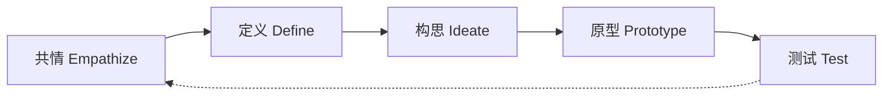

# 🎨 网页 UI/UX 设计知识库

> 融合两轮深度循环学习的精华产出。使用时先确定「设计场景」，再从下面各找答案。

## 快速索引

| 你想做什么？ | 跳转到 |
|:-----------|:------|
| 选 UI 风格（该用扁平化还是粗野主义？） | → [UI 风格决策矩阵](#ui-风格决策矩阵) |
| 查 UX 定律（按钮放哪里、选项多少合适？） | → [UX 七大定律速查](#ux-七大定律速查) |
| 做情感化设计（怎么让用户喜欢产品？） | → [情感化设计三步法](#情感化设计三步法) |
| 做无障碍合规（WCAG 2.2 怎么做？） | → [WCAG 2.2 合规路线图](#wcag-22-合规路线图) |
| 写 CSS 玻璃拟态代码 | → [CSS 现代 UI 实现](#css-现代-ui-实现) |
| 走 Design Thinking 流程 | → [Design Thinking 实战流程](#design-thinking-实战流程) |

---

## UI 风格决策矩阵

### 9 种主流风格一览

| 风格 | 核心哲学 | 对比度 | 无障碍 | 实现成本 | 落地成熟度 | 代表产品 |
|:----|:--------|:-----:|:-----:|:-------:|:---------:|:---------|
| **扁平化设计** | 少即是多，二维简洁 | 高 ✅ | 好 ✅ | 低 | 极高 ✅ | iOS 7+, WP8 |
| **Material Design** | 形式追随感觉 | 中-高 ✅ | 很好 ✅ | 中 | 极高 ✅ | Google 全家桶 |
| **玻璃拟态** | 虚实交融，磨砂玻璃 | 中 ⚠️ | 需注意 | 中 | 局部使用 | macOS Big Sur |
| **新拟物化** | 光影叙事，挤压塑料 | 低 ❌ | 差 ❌ | 高 | 概念为主 | Dribbble 展示 |
| **粗野主义** | 结构外露，反精致 | 高 ✅ | ⚠️ | 低 | 创意项目 | Linear/Notion |
| **极简主义** | 留白多，焦点明确 | 中 | 好 ✅ | 低 | 高 ✅ | Apple/MUJI |
| **侘寂美学** | 在不完美中发现美 | 低 ⚠️ | ⚠️ | 中 | 小众 | 日式品牌 |
| **瑞士风格** | 网格系统，排版至上 | 高 ✅ | 好 ✅ | 中 | 高 ✅ | 经典印刷 |
| **赛博朋克** | 霓虹高对比，未来感 | 高 ✅ | ⚠️ | 中 | 概念/游戏 | 科幻游戏 UI |

### 风格选型决策树

```
项目需求分析 →
├─ 追求可用性/可访问性 → 扁平化 或 Material Design
├─ 追求品牌差异化 → 粗野主义 或 玻璃拟态(局部)
├─ 追求高端质感 → 极简主义 或 侘寂
├─ 追求视觉冲击 → 赛博朋克 或 粗野主义
├─ 移动端应用 → 扁平化 + Material + 菲茨定律热区
├─ 桌面端系统 → 玻璃拟态 + 微交互
└─ 创意型/艺术类 → 瑞士风格 或 混合风格
```

### 风格融合原则
- **80/20 法则**：80% 基础风格（扁平/Material）+ 20% 点缀风格（玻璃/新拟态）
- **一致性优先**：同一产品不要混用 3 种以上风格
- **内容决定形式**：信息密集用扁平/瑞士，氛围导向用玻璃/侘寂
- **可用性>美学**：任何风格都不应牺牲点击可见性和对比度

---

## UX 七大定律速查

| 定律 | 一句话 | 公式 | UX 启示 | 验证方式 |
|:----|:------|:----|:--------|:--------|
| **菲茨定律** | 目标越大越近越好点 | T = a + b log₂(D/W+1) | 重要按钮 ≥44px，放边角/拇指区 | 热力图 + 点击测试 |
| **希克定律** | 选项越多决策越慢 | RT = a + b log₂(n) | 导航≤5 项，分步操作，低频隐藏 | A/B 测试转化率 |
| **米勒定律 7±2** | 人脑一次只能处理 7 块 | — | 选项卡≤5 个，信息 4 位分组 | 任务完成时间 |
| **格式塔原则** | 整体感知 > 部分之和 | — | 接近=相关，相似=同类，连续=引导 | 眼动追踪 |
| **雅各布定律** | 用户依赖已有经验 | — | 遵循平台惯例，不重新发明轮子 | 可用性测试 |
| **泰思勒定律** | 复杂只能转移不能消失 | — | 复杂留给开发，简单给用户 | 认知负荷评估 |
| **莱斯托夫效应** | 特殊容易被记住 | — | CTA 按钮突出设计，关键信息强调 | 回忆测试 |

### 实战应用：Form 设计检查

```html
<!-- ✅ 菲茨定律：按钮紧挨输入框，尺寸≥44px -->
<form>
  <label for="email">邮箱</label>
  <input id="email" type="email" style="height:44px; font-size:16px;">
  <button type="submit" style="min-width:120px; min-height:44px;">
    提交
  </button>
</form>

<!-- ✅ 希克定律：选项 ≤ 5 个 -->
<nav>
  <a href="/">首页</a>
  <a href="/products">产品</a>
  <a href="/about">关于</a>
  <a href="/blog">博客</a>
  <a href="/contact">联系</a>
</nav>
```

---

## 情感化设计三步法

基于 Don Norman 三层模型（来源：jnd.org, IxDF）：

### 第 1 步：本能层（Visceral）— 第一印象
- **目标**：让用户在 3 秒内产生好感
- **手法**：色彩搭配、排版美学、质感纹理、品牌一致性
- **检查**：产品截图放在 Instagram 上，用户会点赞吗？
- **案例**：iMac 彩色外壳、FrancisFrancis! 咖啡机

### 第 2 步：行为层（Behavioral）— 使用愉悦
- **目标**：让用户觉得「好用」「顺手」
- **手法**：流畅过渡动画、及时反馈、减少操作步骤、防错设计
- **检查**：新手用户能否在 30 秒内完成核心任务？
- **案例**：OXO 削皮器人体工学手柄、微信拖拽删除图片

### 第 3 步：反思层（Reflective）— 品牌记忆
- **目标**：让用户愿意分享和推荐
- **手法**：成就系统、个性化定制、品牌故事、社交分享激励
- **检查**：用户会主动向朋友推荐吗？
- **案例**：Keep 成就徽章、Notion 模板社区、Apple 产品生态

### 公式：愉悦 = 本能(美) + 行为(顺) + 反思(分享)

---

## WCAG 2.2 合规路线图

来源：W3C WCAG 22 官方规范 + WebAIM 清单

### 9 项新增标准（2023.10 生效）

| 标准 | 级别 | 要求 | 实现 |
|:----|:---:|:----|:-----|
| 2.4.11 Focus Not Obscured | AA | 焦点不被遮挡 | `scroll-padding: 80px` 避开 sticky header |
| 2.5.7 Dragging Movements | AA | 拖拽有替代方案 | drag 操作同时支持 click |
| 2.5.8 Target Size (Minimum) | AA | 触控目标≥24×24px | 按钮/链接最小尺寸 24px |
| 3.2.6 Consistent Help | A | 帮助位置一致 | 右下角固定帮助按钮 |
| 3.3.7 Redundant Entry | A | 自动填充 | `autocomplete` 属性 |
| 3.3.8 Accessible Auth (Min) | AA | 支持密码管理器 | 标准 `<input type="password">` |

### 实施优先级（P0→P2）

```
P0 🔴 颜色对比度 4.5:1 + 非文本 3:1
P0 🔴 全键盘可操作（Tab/Enter/Arrow）
P1 🟡 焦点可见 (2.4.7) + 不被遮挡 (2.4.11)
P1 🟡 触控目标 ≥24×24px (2.5.8)
P2 🟢 拖拽替代方案 (2.5.7) + 一致帮助 (3.2.6)
P2 🟢 ARIA 标注 + 语义 HTML
```

### CSS 焦点指示器

```css
/* WCAG 2.4.7 + 2.4.13 Focus Appearance */
*:focus-visible {
  outline: 2px solid #4A90D9;
  outline-offset: 2px;
  border-radius: 2px;
}

/* 2.5.8 Target Size：确保可点击区域 */
button, a, input, select {
  min-height: 44px;
  min-width: 44px;     /* 移动端最佳实践 */
}
/* 小屏设备至少 24×24px（WCAG 2.2 AA） */
@media (pointer: coarse) {
  button, a { min-height: 24px; min-width: 24px; }
}
```

---

## CSS 现代 UI 实现

### 玻璃拟态（Glassmorphism）— 2025 生产级

来源：PixCode 2025, LogRocket, vinish.dev（交叉验证 ✅）

```css
/* ⚠️ 渐进增强模式：不支持 backdrop-filter 的浏览器看到实心卡片 */
.glass-card {
  /* 降级：实心背景 */
  background: rgba(30, 30, 30, 0.88);
  border: 1px solid rgba(255, 255, 255, 0.15);
  border-radius: 16px;
  padding: 1.5rem;
  color: #fff;
}

/* 支持 backdrop-filter 的浏览器 → 玻璃效果 */
@supports (backdrop-filter: blur(1px)) or (-webkit-backdrop-filter: blur(1px)) {
  .glass-card {
    background: rgba(255, 255, 255, 0.10);
    backdrop-filter: blur(12px) saturate(180%);
    -webkit-backdrop-filter: blur(12px) saturate(180%);
    box-shadow: 0 8px 32px rgba(0, 0, 0, 0.24);
    /* 触发 GPU 加速 */
    will-change: transform;
  }
}

/* 减少动效偏好 */
@media (prefers-reduced-motion: reduce) {
  .glass-card {
    backdrop-filter: none;
    -webkit-backdrop-filter: none;
    background: rgba(30, 30, 30, 0.88);
  }
}
```

### 亮色模式适配

```css
@media (prefers-color-scheme: light) {
  .glass-card {
    background: rgba(255, 255, 255, 0.55);
    border: 1px solid rgba(255, 255, 255, 0.8);
    backdrop-filter: blur(16px) saturate(140%);
    box-shadow: 0 4px 24px rgba(0, 0, 0, 0.08);
    color: #222;
  }
}
```

### 性能指南
| 规则 | 说明 |
|:----|:-----|
| blur 值 | 8-16px（超过 40px 效果差别不大但 GPU 翻倍） |
| 元素数 | 每视口 ≤3 个玻璃元素 |
| 动画 | 避免在 `backdrop-filter` 元素上做动画 |
| 移动端 | 减小 blur 强度或提供备选样式 |

---

## Design Thinking 实战流程

来源：IDEO 真实案例 + Stanford d.school

### 五阶段速查



### 各阶段工具

| 阶段 | 核心问题 | 工具 | 产出 |
|:----|:--------|:----|:-----|
| **共情** | 用户真正需要什么？ | 情境访谈、沉浸观察、日记研究 | 用户画像、同理心地图 |
| **定义** | 核心问题是什么？ | HMW 提问法、问题重构 | 问题陈述、设计原则 |
| **构思** | 有哪些解决方案？ | 头脑风暴、SCAMPER、思维导图 | 候选方案列表 |
| **原型** | 怎么做出来验证？ | 纸面原型、可交互原型、故事板 | 低保真/高保真原型 |
| **测试** | 用户觉得怎么样？ | 可用性测试、A/B 测试、用户反馈 | 迭代方向 |

### IDEO 实战案例启示

| 项目 | 关键做法 | 成果 |
|:----|:--------|:-----|
| Together Senior Health | 现场访谈 + 共情 → "裸反馈"原则 | 165 人临床试验 |
| Soluna 心理健康 App | 150 年轻人共创 → 找到自我服务需求 | $1.88 亿合同 |
| Sanofi RSV 疫苗 | 跨文化研究 → 从孕期开始沟通 | 全球工具包，60 亿美金营收 |
| Fizik 自行车头盔 | 情境访谈 → "不要蘑菇头"洞察 | 4 款头盔同步发布 |

### 设计验证闭环

```
原型 → 可用性测试 → 数据分析 → 迭代 → 再测试 → 发布
         ↓
  发现痛点 → 回到共情/定义阶段
```

---

## 参考资料

- [Material Design 3 官方](https://m3.material.io/)
- [Google Design — Expressive Design Research](https://design.google/library/expressive-material-design-google-research)
- [Don Norman — Emotional Design](https://jnd.org/emotional-design-people-and-things/)
- [WCAG 2.2 官方规范](https://www.w3.org/TR/WCAG22/)
- [WebAIM WCAG 清单](https://webaim.org/standards/wcag/checklist/)
- [IDEO 设计案例](https://www.ideo.com/case-study)
- [Interaction Design Foundation — Norman's Three Levels](https://www.interaction-design.org/literature/article/norman-s-three-levels-of-design)
