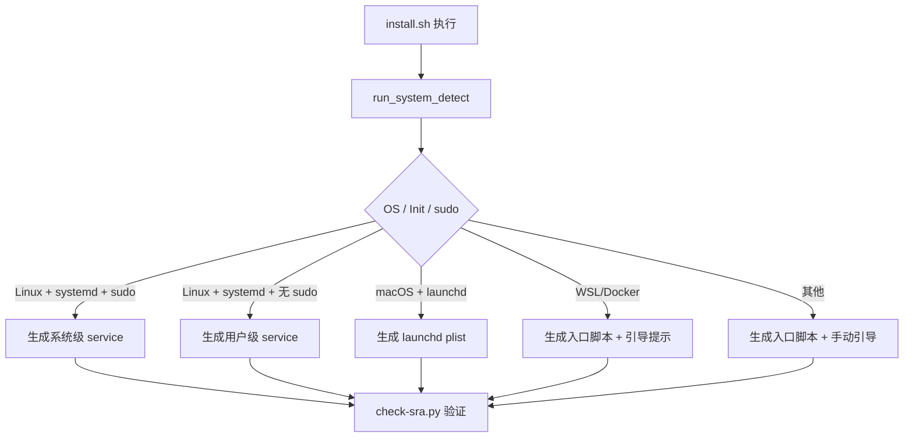

# 跨平台安装自动配置设计模式

> 来源: SRA 项目实战 (2026-05-09)
> 适用于: 任何需要将系统配置作为安装脚本一部分生成的项目

## 问题

AI Agent 安装一个项目时，需要配置开机自启、服务依赖等系统级配置。传统做法是让用户「手动复制文件到系统目录」——这对 AI 不可行。

## 模式

### 核心架构



### 系统检测函数模板

```bash
# 需要实现 6 个检测函数：
detect_os()      # uname -s → linux/darwin/other
detect_init()    # /run/systemd/system? launchctl? → systemd/launchd/other
check_sudo()     # sudo -n true → true/false
check_wsl()      # /proc/version grep microsoft → true/false
check_docker()   # /.dockerenv → true/false
check_hermes()   # command -v hermes → true/false
```

### 配置类型映射

| OS | Init | 有 sudo | 配置目标 | 命令 |
|:---|:---|:---:|:---|:---|
| Linux | systemd | ✅ | `/etc/systemd/system/xxx.service` | `sudo systemctl enable --now` |
| Linux | systemd | ❌ | `~/.config/systemd/user/xxx.service` | `systemctl --user enable --now` |
| macOS | launchd | — | `~/Library/LaunchAgents/com.xxx.plist` | `launchctl load -w` |
| WSL | 无 | — | `~/.xxx/entry.sh` | 任务计划程序引导 |
| Docker | 无 | — | `~/.xxx/entry.sh` | `--restart=always` 引导 |

### 依赖链自动配置

如果项目依赖另一个服务（如 SRA 依赖 Hermes Gateway），应在系统检测后自动配置：

```bash
if [[ "$HAS_HERMES" == "true" ]]; then
    mkdir -p "$SYSTEMD_USER_DIR/hermes-gateway.service.d"
    cat > "$SYSTEMD_USER_DIR/hermes-gateway.service.d/sra-dep.conf" << CONFIGEOF
[Unit]
Requires=srad.service
After=srad.service
CONFIGEOF
fi
```

## 关键原则

1. **不要「移植文件」** — 不要将 systemd/launchd 文件作为静态文件放入仓库
2. **要「脚本生成」** — 安装脚本根据检测结果动态生成适配的配置
3. **每步必有验证** — 每个系统配置步骤后运行 check 脚本确认生效
4. **所有路径使用 `$HOME`** — 不允许硬编码用户名或绝对路径

## 实战检查清单

- [ ] 安装脚本支持 `--systemd` / `--autostart` 参数
- [ ] 脚本在安装前自动检测 OS 类型
- [ ] 脚本根据检测结果自动选择配置生成路径
- [ ] Linux 用户有 sudo → 系统级 service
- [ ] Linux 用户无 sudo → 用户级 service
- [ ] 检测到 Hermes/其他依赖 → 自动配置依赖链
- [ ] macOS → launchd plist
- [ ] 特殊环境（WSL/Docker）→ 入口脚本 + 引导提示
- [ ] 安装后自动运行验证脚本
- [ ] README 中展示跨平台安装支持表格
