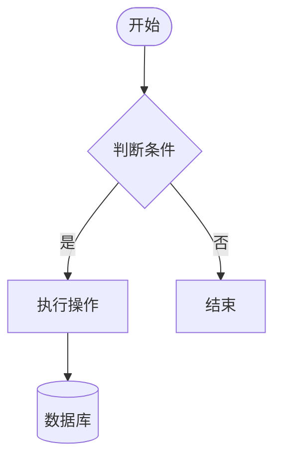
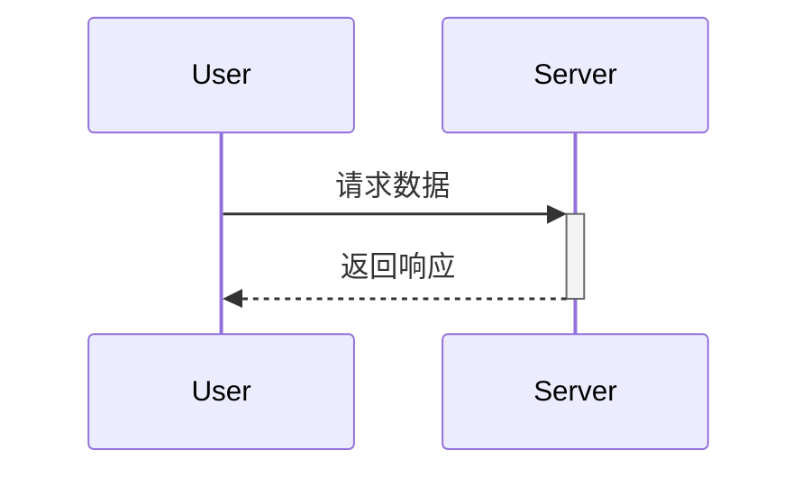
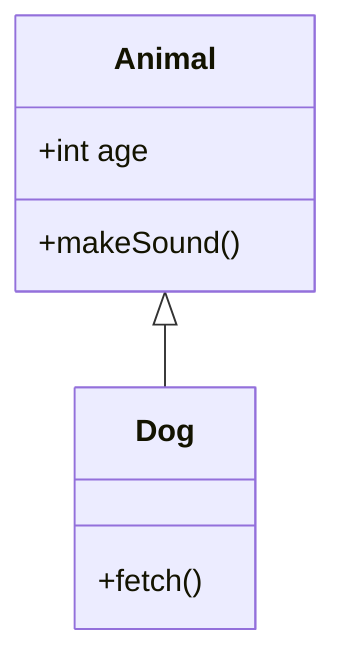
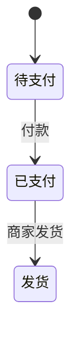

# Mermaid 图表生成指南

> **核心原则**：Mermaid 是“文本即图表”的工具。它允许你在 Markdown 中直接编写代码生成图表，非常适合版本控制和文档集成。

## 触发条件

**使用此 skill 当：**
- 用户要求“画个图”、“生成架构图/流程图/时序图”
- 需要展示逻辑流程、系统交互、类关系或状态流转
- 需要美化文档，增加可视化元素

**不使用此 skill 当：**
- 需要极高精度的矢量绘图（如复杂的机械图纸，应用 excalidraw 或 CAD）
- 需要交互式数据图表（应用 p5js 或 python-matplotlib）

## 语法速查 (Cheat Sheet)

### 1. 流程图 (Flowchart)
**场景**：业务逻辑、算法流程、系统架构。

- **方向**：`flowchart TD` (上下), `LR` (左右), `BT` (下上), `RL` (右左)。
- **形状**：`[]` (矩形), `()` (圆角), `{}` (菱形), `[( )]` (圆柱), `(( ))` (圆形)。
- **连线**：`-->` (实线箭头), `-.->` (虚线), `==>` (粗线)。

### 2. 时序图 (Sequence Diagram)
**场景**：API 调用、模块交互、消息传递。

- **消息**：`->>` (实线), `-->>` (虚线), `->` (无箭头)。`+` 开启激活框，`-` 关闭。
- **分组**：`opt 条件`, `alt 情况 1 ... else 情况 2 ... end`, `loop 循环`, `par 并行`。

### 3. 类图 (Class Diagram)
**场景**：面向对象设计、数据库结构、代码重构。

- **关系**：`<|--` (继承), `*--` (组合), `o--` (聚合), `..>` (依赖)。
- **可见性**：`+` (Public), `-` (Private), `#` (Protected)。

### 4. 状态图 (State Diagram)
**场景**：订单流转、生命周期、状态机。

- **特殊**：`[*]` (开始/结束), `state 复合状态 { ... }`。

> 🔍 **## 场景模板** moved to [references/detailed.md](references/detailed.md)
