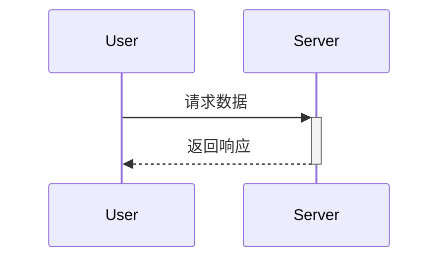
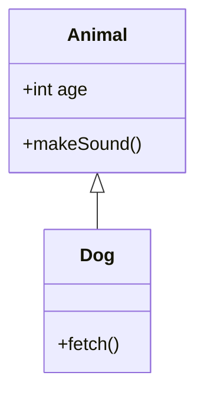

# Mermaid 图表生成指南

> **核心原则**：Mermaid 是"文本即图表"的工具。它允许你在 Markdown 中直接编写代码生成图表，非常适合版本控制和文档集成。

## ⚡ 渲染流水线 (Render Pipeline)

### 本环境验证的 mermaid-cli 渲染方案

```bash
# 用包装脚本一键渲染（自动配置 Chrome 路径）
mmdc-easy -i input.mmd -o output.svg -p puppeteer-config.json
```

### 环境工具链

| 组件 | 路径/版本 | 说明 |
|:---|:---|:---|
| **mmdc** | `/usr/local/bin/mmdc` | mermaid-cli v11.14.0 |
| **包装脚本** | `/usr/local/bin/mmdc-easy` | 自动设置 Chrome 路径 |
| **Chrome** | `/usr/bin/google-chrome` | Google Chrome 147 |
| **Puppeteer 配置** | `{ "executablePath": "/usr/bin/google-chrome", "args": ["--no-sandbox"] }` | Chrome 免沙箱运行 |

### 安装指南（国内环境已验证）

```bash
# 跳过 Chrome 下载，使用系统已有 Chrome
PUPPETEER_SKIP_DOWNLOAD=true \
PUPPETEER_EXECUTABLE_PATH=/usr/bin/google-chrome \
npm install @mermaid-js/mermaid-cli
```

安装后创建包装脚本（需要管理员权限）并配置 Chrome 免沙箱运行。

### 批量渲染脚本

```bash
for mmd in *.mmd; do
    name=$(basename "$mmd" .mmd)
    mmdc-easy -i "$mmd" -o "output/${name}.svg" -p puppeteer-config.json
done
```

### 备用方案：mermaid.ink API（无需安装）

当 mmdc 不可用时，用在线 API 渲染：
```python
import base64, urllib.request
with open("diagram.mmd") as f:
    content = f.read()
encoded = base64.urlsafe_b64encode(content.encode()).decode()
url = f"https://mermaid.ink/svg/{encoded}"
urllib.request.urlretrieve(url, "output.svg")
```

### ⚠️ 已知 Pitfalls（实战踩坑）

| 问题 | 原因 | 解决方案 |
|:---|:---|:---|
| 全局安装权限错误 | 写 `/usr/lib/node_modules/` 需 root | 用本地安装 + symlink |
| 自动下载 Chrome 超时 | Puppeteer 下载 ~300MB | 设 `PUPPETEER_SKIP_DOWNLOAD=true` |
| 旧版环境变量不生效 | 新版 Puppeteer 改变量名 | 用 `PUPPETEER_SKIP_DOWNLOAD` |
| npm 安装超时 | 包依赖重 | 设 `fetch-timeout=300000` |

## 触发条件

**使用此 skill 当：**
- 用户要求“画个图”、“生成架构图/流程图/时序图”
- 需要展示逻辑流程、系统交互、类关系或状态流转
- 需要美化文档，增加可视化元素

**不使用此 skill 当：**
- 需要极高精度的矢量绘图（如复杂的机械图纸，应用 excalidraw 或 CAD）
- 需要交互式数据图表（应用 p5js 或 python-matplotlib）

## 语法速查 (Cheat Sheet)

### 1. 流程图 (Flowchart)
**场景**：业务逻辑、算法流程、系统架构。

- **方向**：`flowchart TD` (上下), `LR` (左右), `BT` (下上), `RL` (右左)。
- **形状**：`[]` (矩形), `()` (圆角), `{}` (菱形), `[( )]` (圆柱), `(( ))` (圆形)。
- **连线**：`-->` (实线箭头), `-.->` (虚线), `==>` (粗线)。

### 2. 时序图 (Sequence Diagram)
**场景**：API 调用、模块交互、消息传递。

- **消息**：`->>` (实线), `-->>` (虚线), `->` (无箭头)。`+` 开启激活框，`-` 关闭。
- **分组**：`opt 条件`, `alt 情况 1 ... else 情况 2 ... end`, `loop 循环`, `par 并行`。

### 3. 类图 (Class Diagram)
**场景**：面向对象设计、数据库结构、代码重构。

- **关系**：`<|--` (继承), `*--` (组合), `o--` (聚合), `..>` (依赖)。
- **可见性**：`+` (Public), `-` (Private), `#` (Protected)。

### 4. 状态图 (State Diagram)
**场景**：订单流转、生命周期、状态机。

- **特殊**：`[*]` (开始/结束), `state 复合状态 { ... }`。


> 🔍 **## 场景模板** moved to [references/detailed.md](references/detailed.md)
