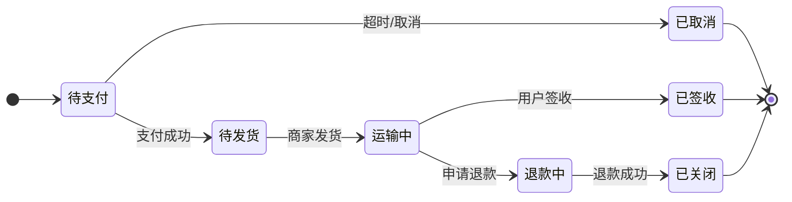
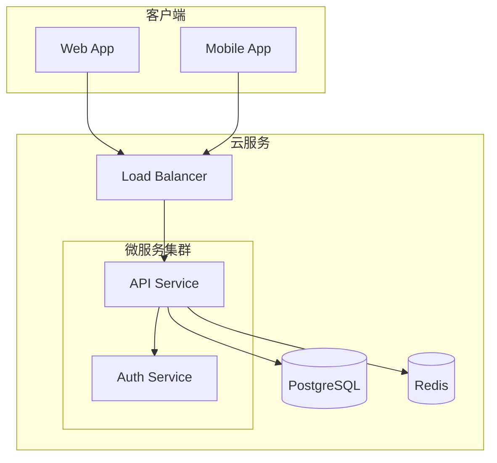

# Detailed Reference

## 场景模板 (Templates)

### 🛒 电商订单状态流转 (State)
> 适用场景：电商系统、工单系统、审批流。


### 🚀 微服务调用链 (Sequence)
> 适用场景：API 网关、鉴权流程、分布式追踪。
```mermaid
sequenceDiagram
    participant Client
    participant Gateway
    participant Auth as Auth Service
    participant API as API Service

    Client->>+Gateway: GET /api/data
    Gateway->>+Auth: Verify Token
    alt Token 有效
        Auth-->>-Gateway: OK
        Gateway->>+API: Forward Request
        API-->>-Gateway: Data
        Gateway-->>-Client: Response 200
    else Token 无效
        Auth-->>-Gateway: 401 Unauthorized
        Gateway-->>-Client: 401
    end
```

### 🏗️ 系统架构图 (Flowchart Subgraphs)
> 适用场景：云原生架构、数据流向、网络拓扑。


## 🖼️ 生图与导出 (Image Rendering)

Mermaid 代码在代码编辑器里只是文本，如果需要放到 PPT、Word 或无法渲染 Markdown 的地方，必须转为图片。

### 官方 CLI 工具 (`mmdc`)
这是最稳定、质量最高的导出方式。

1.  **安装** (需要 Node.js 环境):
    ```bash
    # 国内环境：用腾讯云镜像 + 跳过 Chrome 下载
    PUPPETEER_SKIP_DOWNLOAD=true \
    PUPPETEER_EXECUTABLE_PATH=/usr/bin/google-chrome \
    npm install @mermaid-js/mermaid-cli --registry=https://mirrors.tencentyun.com/npm
    ```

2.  **Puppeteer 配置**:
    创建 `puppeteer-config.json`:
    ```json
    { "executablePath": "/usr/bin/google-chrome", "args": ["--no-sandbox"] }
    ```

3.  **基本用法**:
    ```bash
    mmdc -i input.mmd -o output.png -p puppeteer-config.json
    mmdc -i input.mmd -o output.svg -p puppeteer-config.json
    ```

4.  **高级参数**:
    *   **透明背景** (做 PPT 插图神器！): `mmdc -i input.mmd -o output.png -b transparent -p puppeteer-config.json`
    *   **深色主题**: `mmdc -i input.mmd -o output.png -t dark -p puppeteer-config.json`
    *   **输出 PDF**: `mmdc -i input.mmd -o output.pdf -p puppeteer-config.json`

### 备用方案：mermaid.ink 在线 API

当 mmdc 不可用时，用在线 API 渲染（免安装）：
```python
import base64, urllib.request
with open("diagram.mmd") as f:
    content = f.read()
# 去掉 YAML frontmatter（如果以 --- 开头）
if content.strip().startswith("---"):
    parts = content.split("---", 2)
    if len(parts) >= 3:
        content = parts[2].strip()
encoded = base64.urlsafe_b64encode(content.encode()).decode()
# 输出 SVG
urllib.request.urlretrieve(f"https://mermaid.ink/svg/{encoded}", "output.svg")
```

## 🌐 兼容性速查 (Compatibility)

在不同平台写文档时，Mermaid 的支持程度不同：

| 平台/工具 | 支持情况 | 说明 |
| :--- | :--- | :--- |
| **GitHub / GitLab** | ✅ 原生支持 | Markdown 中直接写代码块即可显示 |
| **Notion** | ✅ 原生支持 | `/code` -> 语言选 Mermaid |
| **Obsidian** | ✅ 原生支持 | 阅读视图和编辑视图均支持 |
| **VS Code** | ✅ 原生支持 | 预览窗口自动渲染 |
| **Confluence** | ⚠️ 需插件 | 需安装 Marketplace 插件 |
| **Word / PPT** | ❌ 不支持 | **必须先用 CLI 导出为图片再插入** |
| **PDF (ReportLab)**| ❌ 不支持 | 必须先生成 PNG/SVG 图片，再嵌入 PDF |

## 排版与美化技巧

1.  **样式定义 (classDef)**: 让图表更好看。
    ```mermaid
    flowchart LR
        A --> B
        classDef warning fill:#f96,stroke:#333,stroke-width:2px;
        class B warning;
    ```
2.  **方向控制**: 使用 `direction LR` 或 `TD` 改变子图方向。
3.  **避免关键字冲突**: 不要使用 `end`, `subgraph`, `style` 等作为节点 ID。如果必须使用，加引号 `"end"`。
4.  **特殊字符**: 使用 HTML 实体转义，如 `&lt;` 代替 `<`。

## Red Flags (常见坑)

- ❌ **节点 ID 不能包含空格**：使用 `_` 或 `-` 代替。
- ❌ **不要在样式中直接用中文作为类名**：容易解析失败，建议用英文 ID 配合 label。
- ❌ **复杂的样式表可能不兼容某些 Markdown 渲染器**：保持样式简单（fill, stroke）。
- ❌ **"end" 关键字**：绝对不能作为节点 ID，否则会导致解析器崩溃。

## 🔍 深度避坑指南 (Deep Dive)

### 📦 版本差异：v10 与 v11 的陷阱
Mermaid v11 是一个破坏性更新 (Breaking Changes)，主要区别如下：
*   **Markdown 标签解析**：v11 默认将标签视为 Markdown 解析。如果你的标签里包含 `*`, `_`, `~` 等符号，可能会被渲染成斜体或删除线。
    *   *解法*：如果不需要 Markdown 效果，请在配置中关闭，或对特殊字符转义。
    *   *现状*：GitHub 等平台可能仍在使用 v10，编写图表时要考虑向前兼容。
*   **新图表类型**：v11 增加了 `venn-beta` (韦恩图) 和 `ishikawa` (鱼骨图/因果图)。
*   **解析器重构**：v11 启用了独立的 `@mermaid-js/parser`，语法校验更严格。

### 🐧 CLI 工具在 Linux 服务器上的“水土不服”
`mmdc` 底层依赖 **Puppeteer** (无头 Chrome)，在纯净的 Linux 环境（如 Docker 或云服务器）中极易报错：
*   **报错 "Failed to launch the browser process"**：通常是因为缺少系统级依赖（如 `libgbm1`, `libnss3`, `libatk1.0-0` 等）。
*   **报错 "No usable sandbox!"**：如果你用 `root` 用户运行，Chrome 会拒绝启动。
    *   *解法*：运行 `mmdc` 时添加 `--no-sandbox` 参数，或者创建非 root 用户运行。
    *   *解法*：设置环境变量 `PUPPETEER_DISABLE_HEADLESS_WARNING=true` 消除警告。

#### Hermes 环境已验证配置
```json
// ~/.mmdc.json
{ "executablePath": "/usr/bin/google-chrome", "args": ["--no-sandbox"] }
```
```bash
mmdc -i input.mmd -o output.png -w 800 --backgroundColor transparent \\
  --puppeteerConfigFile ~/.mmdc.json
```

### 🛡️ 安全限制 (Security Level)
Mermaid 默认开启 `securityLevel: 'strict'`，这会禁止图中的 `click` 事件（如超链接）。
*   如果需要点击跳转，必须设置为 `securityLevel: 'loose'`（但在公共文档中要慎用，防止 XSS）。
*   *配置方法*：在代码块开头加 `%%{init: {'securityLevel': 'loose'}}%%`。

### ⚙️ 高级定制 (Advanced Configuration)
通过 `%%{init: {...}}%%` 可以在单个图表中覆盖全局配置，这对**生成专业级图表**至关重要：

1.  **手绘风格 (Hand-drawn / Sketchy)**:
    想要图表看起来像“手绘”的可爱风格（艾玛推荐！），配置 `look: 'handDrawn'`。
    ```mermaid
    %%{init: {'look': 'handDrawn', 'theme': 'base', 'themeVariables': {'primaryColor': '#ffe6f0'}}}%%
    flowchart LR
        A --> B
    ```

2.  **核心主题变量 (Theme Variables)**:
    *   `primaryColor` / `secondaryColor`: 节点填充色。
    *   `primaryBorderColor`: 边框颜色。
    *   `lineColor`: 连线颜色。
    *   `fontSize`: 全局字体大小（做 PPT 时建议设大一点，如 `18px`）。
    *   `fontFamily`: 字体族（中文推荐 `'STSong-Light', 'Microsoft YaHei', sans-serif`）。

3.  **完整配置示例**:
    ```mermaid
    %%{
      init: {
        'theme': 'base',
        'themeVariables': {
          'primaryColor': '#4A90E2',
          'primaryBorderColor': '#2C3E50',
          'lineColor': '#7F8C8D',
          'fontSize': '16px'
        },
        'flowchart': {
          'curve': 'basis' // 连线使用平滑曲线，更优雅
        }
      }
    }%%
    ```

### 🎨 在 ReportLab PDF 中的最佳实践
当 boku 为主人生成 PDF 报告时，无法直接渲染 Mermaid 代码：
1.  **第一步**：先将 Mermaid 代码保存为 `.mmd` 文件。
2.  **第二步**：调用 `mmdc -i input.mmd -o output.png -b transparent` 生成透明背景 PNG。
3.  **第三步**：使用 ReportLab 的 `Image` 类读取生成的 PNG，并根据页面宽度自动缩放插入。
4.  **注意**：不要直接截图！PNG/SVG 矢量化导出清晰度最高。

## 输出规范

当用户要求画图时，boku 应该：
1.  **确认场景**：是流程？时序？还是架构？
2.  **选择模板**：从上面的模板中选择最接近的一个。
3.  **生成代码**：输出完整的 mermaid 代码块。
4.  **提供解释**：简要说明图中的关键路径。
