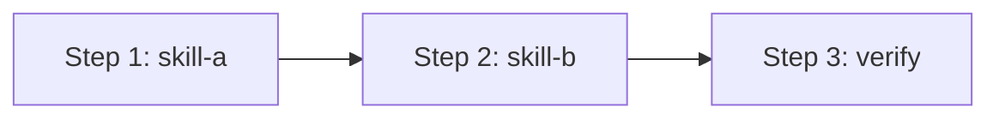

# Meta-Skill Name

## Overview

Orchestrates multiple sub-skills to accomplish a complex task. This meta-skill does NOT replace individual skills — it sequences them.

## When to Use

- Complex multi-step task
- Need to coordinate multiple tools
- Workflow that spans multiple domains

## Dependencies

This meta-skill relies on the following skills:

| Skill | Purpose | Version Required |
|:------|:--------|:----------------:|
| skill-a | Task A | ≥ 1.0.0 |
| skill-b | Task B | ≥ 2.0.0 |

## Orchestration Flow

### Phase 1: Preparation
1. Load skill-a: `skill_view(name='skill-a')`
2. Run initial setup

### Phase 2: Execution
1. Execute skill-b with parameters from Phase 1
2. Collect results

### Phase 3: Verification
1. Validate outputs
2. Report summary

## Common Pitfalls

1. **Missing dependency**: Running Phase 2 without Phase 1 → Always complete phases in order

2. **Version mismatch**: skill-b v3.0 incompatible → Check version requirements

## Verification Checklist

- [ ] All dependencies are installed and at correct versions
- [ ] Phase 1 outputs valid before proceeding to Phase 2
- [ ] Final output matches expected format
